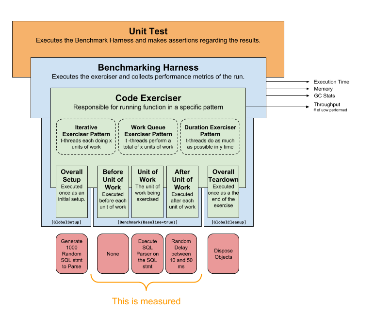

# Overview
This document describes the tools available for code exercising and micro-benchmarking. 


* Exerciser
* Exercise-Pattern
* Unit of Work
* Benchmarker
* Iteration
* Benchmarking Unit Test




# Exerciser
An exerciser is responsible for executing code in a specific pattern.  It is designed to minimize the amount of scaffolding necessary to exercise code in common scenarios/usage-patterns.  An exerciser returns the # of units of work accomplished during its run.
<br>

#### Exerciser Types/Patterns
There are diferent exercisers each implementing a usage pattern.

* **Iterative Exerciser**<br>
Establishes a workload of n-items using t-threads.  Each thread performs all n-units of the workload.  The exerciser is complete when all threads have performed all of their units of work.<br>
<br>

* **Throughput Exerciser**<br>
Establishes a workload for d-duration using t-threads.  Each thread performs as many units of work as possible during the duration.<br>
<br>

* **Work-Queue Exerciser**<br>
Establishes a workload of n-items using t-threads.  Each thread consumes items and performs units of work until the entire workload has been completed.<br>
<br>

#### Configuring an Exerciser
Exercisers are configured using fluent syntax.  Here's an example.

```C#
            var guidGenerationExerciser = IterativeExerciser.Create()
                    .PerformUnitOfWorkNTimes(50)
                    .UsingThreads(10)
                    .DoThisUnitOfWork(() => var result = Guid.NewId());

```
<br>
<br>

* **DoThisUnitOfWork** &nbsp;&nbsp;(required)<br>
Required function that is the unit of work being performed.<br>

```c#
            //Simple Example
             var exerciser = IterativeExerciser.Create()
                .DoThisUnitOfWork(() => var result = Guid.NewId());
```
<br>

```c#
            //Advanced Example - using the unit of work variables
             var exerciser = IterativeExerciser.Create()
                .UsingThreads(10)
                .PerformThisUnitOfWorkNTimes(50)
                .DoThisUnitOfWork(threadId, unitOfWorkIdLocal, unitOfWorkIdGlobal ) => 
                {
                    Console.Writeline($"I am the {unitOfWorkIdLocal}th unit of work on thread {threadId}");
                    Console.Writeline($"Overall, I am the {unitOfWorkIdGlobal}th unit of work across all threads."
                });
```
<br>

* **UsingThreads** &nbsp;&nbsp;(optional, default = 1)<br>
The number of threads that will be performing the workload.  Default value is 1.<br>
<br>

* **DoThisToSetUp** and **DoThisToTearDown** &nbsp;&nbsp;(optional)<br>
Function called to set-up and tear-down the workload.  These functions are executed once at the beginning and end of the exerciser<br>
<br>
  - Setting up of Test Data
  - Disposing of Objects

```c#
            const int unitsOfWorkToDo = 500;
            
            var sqlsToParse = new string[unitsOfWorkToDo];
            
             var exerciser = IterativeExerciser.Create()
                .UsingThreads(10)
                .PerformThisUnitOfWorkNTimes(unitsOfWorkToDo)
                .DoThisToSetup(()=> 
                {
                    //I don't want the generation of random SQL to be part of my measurements
                    //So, i do this setup before the execution.
                    for(var i = 0; i < unitsOfWorkToDo; i++)
                    {
                        sqlsToParse[i] = $"SELECT * FROM dbo.Customer WHERE CustomerID = '{ Guid.NewId()}'";
                    }

                });
                .DoThisUnitOfWork(threadId, unitOfWorkIdLocal, unitOfWorkIdGlobal ) => 
                {
                    var parsedStatement = DatabaseStatementParser.ParseDatabaseStatement(DatastoreVendor.MSSQL, System.Data.CommandType.StoredProcedure, sqlsToParse[unitOfWorkIDLocal]);
                });
```
<br>

* **DoThisBeforeEachUnitofWork** and **DoThisAfterEachUnitOfWork**&nbsp;&nbsp;(optional)<br>
Optional functions that are executed before/after each unit of work.<br>
<br>
  - These delegates may perform setup or teardown specific to the workload.
  - Separation of the unit of work being exercied from before/after setup/teardown steps.
  - A greate place to add busy work to make the exerciser seem more realistic in a contentious scenario.
<br>

```c#
             var exerciser = IterativeExerciser.Create()
                .UsingThreads(10)
                .PerformThisUnitOfWorkNTimes(500)
                .DoThisUnitOfWork() => 
                {
                    var newGuid = GuidGenerator.GenerateNewRelicGuid();
                });
                .DoThisAfterEachUnitOfWork() => 
                {
                    //Let's introduce some busy work to make this more realistic in a contentious environment.
                    var rnd = new Random();
                    var randomDelay = rnd.Next(100);
                    Thread.Sleep(randomDelay);
                });
```
<br>

* **PerformUnitOfWorkNTimes** - IterativeExerciser &nbsp;&nbsp;(optional, default = 1)<br>
Defines the number of items each thread will perform.
```c#
            //Have 10 threads each performing 1000 units of work => 10,000 units of work total.
             var exerciser = IterativeExerciser.Create()
                .UsingThreads(10)
                .PerformUnitOfWorkNTimes(1000)
                .DoThisUnitOfWork() => 
                {
                    var newGuid = GuidGenerator.GenerateNewRelicGuid();
                });
```
<br>

* **WithWorkQueueSize** - WorkQueueExerciser &nbsp;&nbsp;(optional, default = 1)<br>
Defines the size of the work queue.
```c#
            //Have 10 threads consuming work until 1000 have been accomplished.
            //=> 1,000 Units of Work In total.
             var exerciser = WorkQueueExerciser.Create()
                .UsingThreads(10)
                .WithWorkQueueSize(1000)
                .DoThisUnitOfWork() => 
                {
                    var newGuid = GuidGenerator.GenerateNewRelicGuid();
                });
```
<br>

* **ForDuration** - ThroughputExerciser &nbsp;&nbsp;(optional, default = 1sec)<br>
Defines how long the exerciser will run.

```c#
            //Have 10 threads working for 5-seconds => ??? Units of Work In total.
            var exerciser = ThroughputExerciser.Create()
                .UsingThreads(10)
                .ForDuration(new Timespan(0,0,5)        //5-seconds
                .DoThisUnitOfWork() => 
                {
                    var newGuid = GuidGenerator.GenerateNewRelicGuid();
                });
```
<br>

#### Unit of Work Variables
The following variables are available for your unit of work functions (DoThisBeforeEachUnitOfWork, DoThisUnitOfWork, DoThisAfterEachUnitOfWork).
* ```ThreadId```<br>
Index of the thread performing the work.  Not to be confused with the thread id assigned by the OS.
<br><br>
* ```UnitOfWorkIdLocal```<br>
Within a thread, the index of the unit of work being performed.
<br><br>
* ```UnitOfWorkIdGlobal```<br>
Across all threads, a unique identifier for the unit of work being perofrmed.

```c#
	var exerciser = IterativeExerciser.Create()
            .UsingThreads(10)
            .PerformThisUnitOfWorkNTimes(50)
            .DoThisUnitOfWork(threadId, unitOfWorkIdLocal, unitOfWorkIdGlobal ) => 
            {
                Console.Writeline($"I am the {unitOfWorkIdLocal}th unit of work on thread {threadId}");
                Console.Writeline($"Overall, I am the {unitOfWorkIdGlobal}th unit of work across all threads."
            });
```
<br>
<br>

# Benchmarker
A benchmarker is responsible for running an exerciser and for measuring the performance characteristics of the run.  It is a harness on BenchmarkDotNet.  

#### Types of Information collected
The benchmarker collecs the following type of information:

* Execution Time
* Memory Allocation
* Garbage Collection
* Units of Work Performed (pass-through from exerciser)

#### Defining a Benchmarker Class
Because the benchmarker is run by BenchmarkDotNet, it is required to be in its own class.  Accordingly, defining a benchmarker entails creating a new class.  

```C#
	public class GuidBenchmarker : BenchmarkDotNetWrapper<GuidBenchmarker>
	{
		//This is the only thing that I have to implement
		public override Exerciser Exerciser => IterativeExerciser.Create()
			.DoThisUnitOfWork(() => { var newGuid = Guid.NewGuid(); })
			.PerformUnitOfWorkNTimes(100)
			.UsingThreads(3);
	}
```


##### Executing a Benchmarker
Executing a benchmarker occurs by calling the static Execute method.

```C#
	var benchmarkResult = GuidBenchmarker.Execute();
```
After executing an benchmark, the following results are available.
* StartTime
* EndTime
* Memory_BytesAllocated
* GC_Gen0Collections
* GC_Gen1Collections
* GC_Gen2Collections
* Duration_Mean_Nanoseconds
* Duration_Min_Nanoseconds
* Duration_Max_Nanoseconds
* Duration_StdDev_Nanoseconds
* CountUnitsOfWorkExecuted_Min
* CountUnitsOfWorkExecuted_Max
* CountUnitsOfWorkExecuted_Mean
* CountUnitsOfWorkExecuted_StdDev
* CountExceptions


##### Design Considerations
* Benchmark classes must be declared as a public classes.  They may be declared as a nested class within another (like a unit test).

```C#
	//This won't work
	class GuidBenchmarker : BenchmarkDotNetWrapper<GuidBenchmarker>
	{
		//This is the only thing that I have to implement
		public override Exerciser Exerciser => IterativeExerciser.Create()
			.DoThisUnitOfWork(() => { var newGuid = Guid.NewGuid(); })
			.PerformUnitOfWorkNTimes(100)
			.UsingThreads(3);
	}
```
<br>


```C#
	//This will work
	public class GuidBenchmarker : BenchmarkDotNetWrapper<GuidBenchmarker>
	{
		//This is the only thing that I have to implement
		public override Exerciser Exerciser => IterativeExerciser.Create()
			.DoThisUnitOfWork(() => { var newGuid = Guid.NewGuid(); })
			.PerformUnitOfWorkNTimes(100)
			.UsingThreads(3);
	}
```
* Benchmark classes must have a public parameterless constructor.
* BenchmarkDotNet will execute your exerciser multiple times in order to get accurate statistics.  
  - Ensure that the exerciser is capable of being run multiple times without negative consequences.
  - Consider the duration/workload size of the exerciser keeping in mind the it may run multiple times.  For example, running a test for 1-minute may result in a benchmarker that takes 100-minutes to complete.

* Any state that your exerciser requires, should be defined within the benchmarker class.  BenchmarkDotNet will create an executable of your class and run it.

```c#
//This is a bad example
public class BadGuidTests
{
	private ConcurrentBag<Guid> _resultingGuids = new ConcurrentBag<Guid>();

	public class BadExampleGuidBenchmarker : BenchmarkDotNetWrapper<BadExampleGuidBenchmarker>
	{
		public override Exerciser Exerciser => IterativeExerciser.Create()
			.DoThisUnitOfWork(() => 
				{ 
					var newGuid = Guid.NewGuid();
					//This will compile, but will cause problems because
					//_resultingGuids is outside of the benchmark class.
					_resultingGuids.Add(newGuid) 
				})
			.PerformUnitOfWorkNTimes(100)
			.UsingThreads(3);
	}

	[Test]
	public void MyBadUnitTest()
	{
		var BadExampleGuidBenchmarker.Execute();
	}
}
```
<br>

```c#
//This is a good example
public class GoodGuidTests
{	
	public class GoodExampleGuidBenchmarker : BenchmarkDotNetWrapper<GoodExampleGuidBenchmarker>
	{

		private ConcurrentBag<Guid> _resultingGuids = new ConcurrentBag<Guid>();

		public override Exerciser Exerciser => IterativeExerciser.Create()
			.DoThisUnitOfWork(() => 
				{ 
					var newGuid = Guid.NewGuid();
					//This will compile, but will cause problems because
					//_resultingGuids is outside of the benchmark class.
					_resultingGuids.Add(newGuid) 
				})
			.PerformUnitOfWorkNTimes(100)
			.UsingThreads(3);
	}

	[Test]
	public void MyGoodUnitTest()
	{
		var GoodExampleGuidBenchmarker.Execute();
	}
}
```
<br><br>
# Benchmark/Exerciser Unit Tests
Unit tests that make assertions against the output of the exerciser, the benchmarker, or a comparison of two benchmarks.

#### Example Scenarios
* **Contention**<br>
Use an exerciser alone to ensure that code functions properly under contention or multiple executions.

```c#
	//This code works under a single thread, but fails under mulple threads.
	[Test]
	public void TestDoSomethingBad()
	{
		var badIdea = new Dictionary<int, Guid>();

		Guid DoSomethingWrong(int key, Guid val)
		{
			if (!badIdea.ContainsKey(key))
			{
				Thread.Sleep(100);      //sleep for 100ms
				badIdea.Add(key, val);
				return val;
			}

			return badIdea[key];
		}

		//This causes a contention problem
		var exerciserResult = IterativeExerciser.Create()
			.UsingThreads(10)
			.PerformUnitOfWorkNTimes(50)
			.DoThisUnitOfWork((threadId, unitOfWorkIdLocal, unitOfWorkIdGlobal) => 
			{
				DoSomethingWrong(unitOfWorkIdLocal, Guid.NewGuid());
			})
			.ExecAll();
	}
```

* **Throughput changes**<br>
Ensuring that throughput changes as expected when a performance enhancement, such as caching, is applied.

```c#
	[Test]
	public void Example_DatabaseStatementParser()
	{
		DatabaseStatementParser dbParser = null;

		var cachedThroughput = ThroughputExerciser.Create()
			.UsingThreads(10)
			.ForDuration(1000)  // 1 second
			.DoThisToSetup(() => { dbParser = new DatabaseStatementParser(); })
			.DoThisUnitOfWork((threadId, uowIdLocal, uowIdGlobal) =>
			{
				var stmt = dbParser.ParseDatabaseStatement(DatastoreVendor.MSSQL, CommandType.Text, $"SELECT * FROM dbo.User WHERE UserID = {uowIdLocal}");
			})
			.ExecAll();

		var notCachedThroughput = ThroughputExerciser.Create()
			.UsingThreads(10)
			.ForDuration(1000)  // 1 second
			.DoThisToSetup(() => { dbParser = new DatabaseStatementParser(); })
			.DoThisUnitOfWork((threadId, uowIdLocal, uowIdGlobal) =>
			{
				var stmt = SqlParser.GetParsedDatabaseStatement(DatastoreVendor.MSSQL, CommandType.Text, $"SELECT * FROM dbo.User WHERE UserID = {uowIdLocal}");
			})
			.ExecAll();

		//Caching makes things better
		ClassicAssert.Greater(cachedThroughput.CountUnitsOfWorkPerformed, notCachedThroughput.CountUnitsOfWorkPerformed);

		//Chaching makes things 50% better
		ClassicAssert.Greater(cachedThroughput.CountUnitsOfWorkPerformed, notCachedThroughput.CountUnitsOfWorkPerformed * 1.5);
	}
```
* **Performance Characteristics**<br>
Compare two benchmarks to see how the results compare.


#### BenchmarkComparer helper class
A class that accepts the results of two benchmarks and provides helper functions compare their results.
* Benchmark Result of Reference Operation
* Benchmark Result of Tested Operation
<br>

```c#
	[Test]
	public void Example_CompareTwoBenchmarks()
	{
		var guidResult = NewRelicGuidGeneratorBenchmark.Execute();
		var referenceResult = StandardGuidBenchmark.Execute();

		var comparer = BenchmarkResultComparer.Create(guidResult, referenceResult);

		// the time it takes to generate 1000 guids on 10 threads should never run longer than 2x
		// the time it takes to generate 1000 strings on 10-threads should never run mmor
		ClassicAssert.Less(comparer.Duration_Mean_Nanoseconds_Ratio,2);
	}
```

Two Types of helper propeties:
<br>

* **Difference** &nbsp; &nbsp;(TestOperation - ReferenceOperation)<br>
Calculates the difference between the test operation and the reference operation.  Values > 0 indicate that the test operation used more resources than the reference opeartion.<br>

  - Memory_BytesAllocated_Difference 
  - GC_Gen0Collections_Difference 
  - GC_Gen1Collections_Difference 
  - GC_Gen2Collections_Difference 
  - Duration_Min_Nanoseconds_Difference 
  - Duration_Mean_Nanoseconds_Difference 
  - Duration_Max_Nanoseconds_Difference 
  - Duration_StdDev_Nanoseconds_Difference
  - CountUnitsOfWorkExecuted_Min_Difference
  - CountUnitsOfWorkExecuted_Mean_Difference
  - CountUnitsOfWorkExecuted_Max_Difference
  - CountUnitsOfWorkExecuted_StdDev_Difference
<br>

* **Ratio**  &nbsp; &nbsp;(TestOperation / ReferenceOperation)<br>
Calculates the difference between the test operation and the reference operation as a ratio/percentage.  Values > 1 indicate that the test operation used more resources than the reference operation.
  - Memory_BytesAllocated_Ratio 
  - GC_Gen0Collections_Ratio 
  - GC_Gen1Collections_Ratio 
  - GC_Gen2Collections_Ratio 
  - Duration_Min_Nanoseconds_Ratio 
  - Duration_Mean_Nanoseconds_Ratio 
  - Duration_Max_Nanoseconds_Ratio 
  - Duration_StdDev_Nanoseconds_Ratio
  - CountUnitsOfWorkExecuted_Min_Ratio
  - CountUnitsOfWorkExecuted_Mean_Ratio
  - CountUnitsOfWorkExecuted_Max_Ratio
  - CountUnitsOfWorkExecuted_StdDev_Ratio
