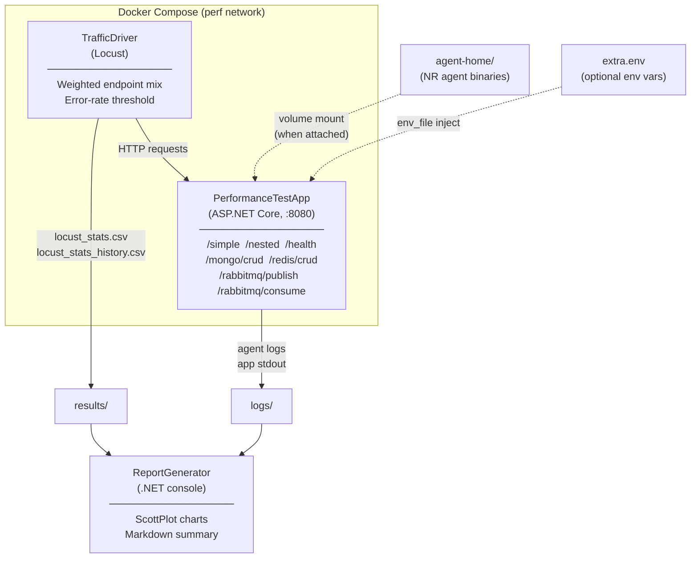

# .NET Agent Performance Tests

Measures the overhead introduced by the New Relic .NET agent by driving HTTP load against a
containerised ASP.NET Core application, with and without the agent attached, and comparing the
resulting throughput, response-time percentiles, CPU usage, and memory usage.

## Architecture



### Components

| Component | Technology | Purpose |
|---|---|---|
| **PerformanceTestApp** | ASP.NET Core (.NET 10) | Synthetic workload server — endpoints exercising simple JSON, nested async, MongoDB CRUD, Redis CRUD, RabbitMQ publish/consume, and health; uses Serilog for structured log forwarding |
| **TrafficDriver** | Python / Locust | Generates a weighted mix of requests, enforces a <1 % error-rate threshold, writes Locust CSV result files |
| **ReportGenerator** | .NET 10 console app | Post-run analysis: reads Locust and Docker stats CSVs, generates ScottPlot PNG charts and a `summary.md` |
| **run-perf-test.py** | Python | Orchestrates a single test run: writes `extra.env`, builds and starts Docker Compose, polls health, collects Docker stats, captures logs, validates results, prints a Markdown summary |
| **run-perf-comparison.py** | Python | Runs multiple sequential configurations (baseline, local build, release, CI artifact) and invokes the ReportGenerator against the collected results |

### How the agent is attached

`run-perf-test.py` mounts a local directory into the container at `/usr/local/newrelic-dotnet-agent` and
sets `CORECLR_ENABLE_PROFILING=1` (or `0` for the no-agent baseline). The agent home directory is
populated by `run-perf-comparison.py` before each run — from a local path, a downloaded archive, or a
GitHub Actions artifact — and cleared between runs so no files from a previous run can linger.

---

## Running locally

### Prerequisites

- Docker Desktop (Linux containers mode)
- Python 3 (`python --version`)
- `pip install pyyaml` (for `run-perf-comparison.py`)
- `gh` CLI authenticated (only needed for `github_artifact` agent sources)
- A New Relic license key (only needed when `--attach-agent true`)

### Single run

```bash
cd tests/Agent/PerformanceTests

# No-agent baseline (default)
python run-perf-test.py

# With agent attached
python run-perf-test.py \
  --attach-agent true \
  --agent-home /path/to/newrelichome_x64_coreclr_linux \
  --license-key YOUR_LICENSE_KEY \
  --test-duration 5m \
  --locust-users 20

# Pass extra agent configuration
python run-perf-test.py \
  --attach-agent true \
  --agent-home /path/to/newrelichome_x64_coreclr_linux \
  --license-key YOUR_LICENSE_KEY \
  --env NEW_RELIC_LOG_LEVEL=debug \
  --env NEW_RELIC_DISTRIBUTED_TRACING_ENABLED=false
```

Results land in `results/` and logs in `logs/`. A Markdown summary is printed to stdout.

**All options:**

| Option | Default | Description |
|---|---|---|
| `--attach-agent` | `false` | Attach the New Relic agent |
| `--agent-home` | `$CORECLR_NEWRELIC_HOME` | Agent home directory |
| `--app-name` | `dotnet-agent-perf-test-local` | New Relic app name |
| `--test-duration` | `2m` | Locust `--run-time` value |
| `--locust-users` | `10` | Concurrent Locust users |
| `--locust-spawn-rate` | `2` | Users spawned per second |
| `--dotnet-version` | `10.0` | .NET version for test app container |
| `--license-key` | `$NEW_RELIC_LICENSE_KEY` | New Relic license key |
| `--collector-host` | `$NEW_RELIC_HOST` | New Relic collector host |
| `--env NAME=VALUE` | _(repeatable)_ | Extra env vars forwarded into the test app container |
| `--verbose` | `false` | Print container logs after the run |

### Comparison run

Copy the example config and edit it:

```bash
cp compare.example.yml compare.yml
# edit compare.yml to define your runs
python run-perf-comparison.py --config compare.yml
```

The comparison runner executes each run sequentially, moves its `results/` and `logs/` into a
timestamped directory (`comparison-results/<timestamp>/perf-results-<label>/`), then builds and
runs the ReportGenerator container to produce PNG charts and a `summary.md`.

**`compare.yml` structure:**

```yaml
test:
  duration: 2m
  locust_users: 10
  locust_spawn_rate: 2
  dotnet_version: "10.0"

runs:
  - label: no-agent
    attach_agent: false

  - label: latest-release
    attach_agent: true
    agent_source:
      type: github_artifact   # or: local, url
      run_id: 12345678901     # all_solutions.yml run ID

  - label: local-build
    attach_agent: true
    agent_env:
      NEW_RELIC_LOG_LEVEL: debug
    agent_source:
      type: local
      path: /path/to/newrelichome_x64_coreclr_linux
```

Agent source types:

| Type | Required fields | Description |
|---|---|---|
| `local` | `path` | Copy from a local directory |
| `url` | `url` | Download a `.zip` or `.tar.gz` archive |
| `github_artifact` | `run_id` or `run_url` | Download `homefolders` artifact from an `all_solutions.yml` run via `gh` CLI |

---

## Running in CI

Two GitHub Actions files drive CI performance testing:

| File | Purpose |
|---|---|
| [`.github/workflows/compare_performance.yml`](../../../.github/workflows/compare_performance.yml) | Top-level workflow — runs up to 5 parallel test configurations and generates a comparative report |
| [`.github/actions/run-perf-test/action.yml`](../../../.github/actions/run-perf-test/action.yml) | Composite action — downloads the agent, invokes `run-perf-test.py`, uploads result and log artifacts |

### Scheduled nightly run

Runs automatically on weekdays at 11:00 UTC (Monday–Friday). Compares:
- **Run 1** — latest published GitHub release
- **Run 2** — most recent successful nightly `all_solutions.yml` build

Results appear in the workflow's Step Summary and as downloadable artifacts (`perf-results-*`,
`perf-logs-*`, `perf-report`).

### Manual `workflow_dispatch` run

Trigger from **Actions → Compare Performance → Run workflow**. Configurable inputs:

| Input | Description |
|---|---|
| `include_no_agent` | Include a no-agent baseline run |
| `run1_agent` | Agent for run 1: version (e.g. `10.49.0`), `all_solutions.yml` run ID, or empty for latest release |
| `run1_label` | Display label for run 1 |
| `include_run2` … `include_run4` | Enable optional runs 2–4 |
| `run2_agent` … `run4_agent` | Agent source for each optional run |
| `*_agent_env` | Extra env vars for a run, semicolon-separated: `VAR1=val1;VAR2=val2` |
| `test_duration` | Locust `--run-time` (e.g. `5m`) |
| `locust_users` | Concurrent users |
| `dotnet_version` | .NET version for the test app container |

Run 1 always executes. Runs 2–4 are opt-in. A no-agent baseline is included by default.

### Required secret

When any agent run is included, the `PERF_TEST_ACCOUNT` secret must be set on the repository:

```
PERF_TEST_ACCOUNT=<license_key>,<collector_host>
```

Example: `XXXXXXXXXXXX,collector.newrelic.com`

## Design Decisions

### Why Docker? Why collect performance data at the container level using `docker stats` instead of, say, `dotnet-counters` in a sidecar?

The pattern of running performance tests in Docker and collecting performance metrics at the container level was initially established by the PHP agent team's [Soak Tests](https://github.com/newrelic/php-agent-testing/tree/main/soak-tests) and continued by the Ruby agent team's [PerfVerse](https://github.com/newrelic/newrelic-ruby-agent/tree/dev/test/perfverse).  Those teams determined that container-level metrics were the most stable and repeatable option.

### Why Python?

`bash` was initially used for the initial workflow to run a single performance test, which worked perfectly well in GitHub Actions, but caused complications for .NET agent team members with Windows development systems.  Some of us have `git-bash` installed and use it daily, some do not.  There are particular problems caused by how string that represent paths (e.g. `C:\workspace\newrelic-dotnet-agent`) are interpreted by either `git-bash` or the `bash` that runs in WSL2, and further problems caused by how Docker interprets those paths when mapping host paths into containers. Using python, which both readily available in GitHub Actions runners *and* a requirement of one of our integration tests (as well as being Claude Code's favorite tool for data analysis) bypasses those issues.  Also, we wanted to use a YAML config file for the local comparison-and-report tool, and `bash` doesn't have a standard way to parse YAML.  Finally, writing all of these scripts in .NET itself would have been overkill.  
